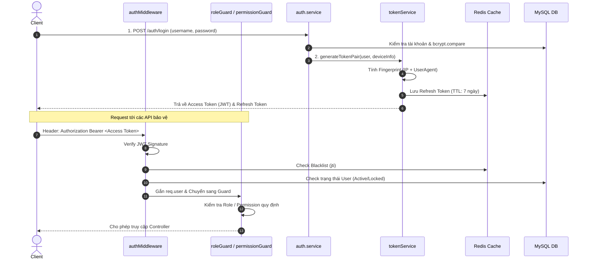
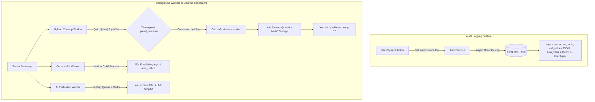

# Tài liệu Kỹ thuật: Luồng 1 (Auth & RBAC) và Luồng 8 (Audit & Worker Cleanup)

Dự án: **Entrepreneurship Hub (E-HUB)**

---

## 🔐 LUỒNG 1: AUTH & PHÂN QUYỀN RBAC (AUTHENTICATION & AUTHORIZATION)

### 1. Tổng quan
Luồng 1 chịu trách nhiệm xác thực danh tính người dùng (Authentication), quản lý phiên làm việc bằng cặp JWT Access Token + Refresh Token (kèm các cơ chế bảo mật nâng cao như Device Binding Fingerprint, Redis Blacklisting, Token Rotation), và phân quyền chi tiết (Authorization) theo Vai trò (Role) và Quyền hạn (Permission).

---

### 2. Kiến trúc & Sơ đồ Luồng (Sequence Diagram)

---

### 3. Chi tiết Xử lý Kỹ thuật & File Mã nguồn

#### 3.1. Cơ chế Xác thực (Authentication)
*   **Đăng nhập truyền thống (`username` & `password`)**:
    *   *File liên quan*: [`auth.service.js`](file:///c:/Users/de180/Downloads/WDP/Entrepreneurship-Hub/ehub-server/app/modules/auth/auth.service.js#L143-L182)
    *   Xác thực người dùng qua DB, kiểm tra mật khẩu đã hash với `bcrypt.compare`.
    *   Hỗ trợ đăng nhập bằng Mã số sinh viên (MSSV), Username hoặc Email.
*   **Đăng nhập Google OAuth 2.0 & Whitelist Roster**:
    *   *File liên quan*: [`auth.service.js`](file:///c:/Users/de180/Downloads/WDP/Entrepreneurship-Hub/ehub-server/app/modules/auth/auth.service.js#L277-L422)
    *   Tạo Google OAuth Consent URL và xử lý đổi Authorization Code lấy Google Profile.
    *   **Whitelist Check**: Kiểm tra email Google có thuộc danh sách User hoặc danh sách Sinh viên Lớp học (`students` roster). Nếu không thuộc danh sách -> Từ chối truy cập (`403 Forbidden`).
    *   **Kích hoạt tài khoản Sinh viên**: Nếu sinh viên có trong roster nhưng chưa có mật khẩu, hệ thống trả về `setup_required: true` kèm `setup_token` (JWT thời hạn 15m) để chuyển sang màn hình hoàn tất đặt mật khẩu & liên kết MSSV ([`completeGoogleSetup`](file:///c:/Users/de180/Downloads/WDP/Entrepreneurship-Hub/ehub-server/app/modules/auth/auth.service.js#L427-L482)).
*   **Kích hoạt qua Email Mời (`activateWithInvite`)**:
    *   *File liên quan*: [`auth.service.js`](file:///c:/Users/de180/Downloads/WDP/Entrepreneurship-Hub/ehub-server/app/modules/auth/auth.service.js#L527-L605)
    *   Xử lý trong một **DB Transaction**: Kiểm tra token mời -> Tạo tài khoản `users` mới -> Gán role `student` -> Đổi trạng thái sinh viên thành `active` -> Đánh dấu token đã sử dụng.

#### 3.2. Quản lý Phiên & Bảo mật Token (Token Lifecycle & Security)
*   *File liên quan*: [`tokenService.js`](file:///c:/Users/de180/Downloads/WDP/Entrepreneurship-Hub/ehub-server/app/core/services/tokenService.js)
*   **Cặp Token**:
    *   **Access Token**: Thời hạn ngắn (15-30m), chứa `sub` (userId), `email`, `roles`, và UUID `jti`.
    *   **Refresh Token**: Thời hạn dài (7 ngày), lưu tại Redis theo key `refresh_token:userId:tokenId`.
*   **Device Binding Fingerprint**:
    *   Tính `sha256(IP + UserAgent)`. Mỗi lần Refresh Token, hệ thống đối soát Fingerprint. Nếu không khớp (dấu hiệu trộm token sang máy khác) -> Tự động thu hồi toàn bộ token (`revokeAllTokens`).
*   **Phát hiện Sử dụng lại Token (Reuse Detection)**:
    *   Nếu một Refresh Token đã bị xoá/dùng rồi bị gửi lại, hệ thống nhận diện tấn công Replay Attack và lập tức huỷ toàn bộ phiên của User trong Redis.
*   **Blacklisting & Rotation**:
    *   Mỗi lần Refresh, Refresh Token cũ bị xoá và Access Token `jti` cũ được đưa vào Redis Blacklist (`blacklist:jti`).

#### 3.3. Cơ chế Phân quyền (Authorization & RBAC)
*   **Xác thực Token Middleware ([`authMiddleware.js`](file:///c:/Users/de180/Downloads/WDP/Entrepreneurship-Hub/ehub-server/app/core/middlewares/authMiddleware.js))**:
    *   Giải mã JWT, kiểm tra Blacklist trên Redis.
    *   Gọi `assertRequestUserStatus` kiểm tra xem tài khoản có bị `locked` hoặc `inactive` không.
*   **Role Guard ([`roleGuard.js`](file:///c:/Users/de180/Downloads/WDP/Entrepreneurship-Hub/ehub-server/app/core/middlewares/roleGuard.js))**:
    *   Kiểm tra vai trò người dùng (vd: `roleGuard('admin', 'lecturer')`).
*   **Permission Guard ([`permissionGuard.js`](file:///c:/Users/de180/Downloads/WDP/Entrepreneurship-Hub/ehub-server/app/core/middlewares/permissionGuard.js))**:
    *   Truy vấn quyền chi tiết (`permissions`) từ DB theo quan hệ `users -> user_roles -> role_permissions -> permissions` (vd: `permissionGuard(container, 'class:create')`).

---

## 🧹 LUỒNG 8: AUDIT & WORKER CLEANUP

### 1. Tổng quan
Luồng 8 bao gồm 2 mảng chính:
1. **Audit Logging (Nhật ký Hệ thống & Bảo mật)**: Ghi vết minh bạch mọi thao tác làm thay đổi dữ liệu nhạy cảm hoặc sự kiện an ninh.
2. **Background Workers & Scheduler Cleanup**: Tiến trình chạy ngầm (Asynchronous Workers) tự động dọn dẹp tài nguyên/dữ liệu rác và xử lý tác vụ nặng.

---

### 2. Kiến trúc & Sơ đồ Luồng (Flowchart)

---

### 3. Chi tiết Xử lý Kỹ thuật & File Mã nguồn

#### 3.1. Hệ thống Nhật ký Hệ thống (Audit Logging)
*   *File liên quan*: [`audit.service.js`](file:///c:/Users/de180/Downloads/WDP/Entrepreneurship-Hub/ehub-server/app/modules/audit/audit.service.js) & [`audit.repository.js`](file:///c:/Users/de180/Downloads/WDP/Entrepreneurship-Hub/ehub-server/app/modules/audit/audit.repository.js)
*   **Enterprise Centralized Audit**:
    *   Mọi module lớn (Auth, Class, Group, Mentor, Incubation, Admin) đều tiêm `auditService`.
*   **Cấu trúc dữ liệu Audit Log (`audit_logs`)**:
    *   `user_id`: ID người thực hiện (Actor).
    *   `action`: Mã hành động (vd: `login`, `register`, `update_profile`, `mentor_assignment_create`, `startup_update`).
    *   `table_name` & `record_id`: Tên bảng và ID bản ghi chịu ảnh hưởng.
    *   `title`: Mô tả tiêu đề đối tượng dạng human-readable.
    *   `old_values` & `new_values`: Lưu dưới dạng **JSON Snapshot** trước và sau khi thay đổi (Diff Data). Mật khẩu được ẩn thành `[HIDDEN]`.
    *   `ip_address` & `user_agent`: Địa chỉ IP và thiết bị thao tác.
*   **Non-blocking Error Handling**:
    *   Việc ghi Audit Log được bọc trong `try-catch`. Lỗi ghi log không làm crash hay rollback giao dịch chính của người dùng.

#### 3.2. Background Workers & Cleanup Schedulers

##### A. Upload & File Cleanup Worker
*   *File liên quan*: [`uploadCleanup.worker.js`](file:///c:/Users/de180/Downloads/WDP/Entrepreneurship-Hub/ehub-server/app/core/workers/uploadCleanup.worker.js)
*   **Nghiệp vụ**: Dọn dẹp các tệp tải lên mồ côi (orphaned files) hoặc phiên nộp bài dở dang đã hết hạn.
*   **Cơ chế Scheduler**:
    *   Chạy tuần hoàn ngầm (mặc định 1 giờ/lần + kích hoạt 1 lần sau 10s khi start server).
    *   **Quy trình 4 bước**:
        1. Tìm phiên upload hết hạn trong DB (`findExpiredUploadSessions`).
        2. Đổi trạng thái phiên thành `expired` ngay lập tức (chống race condition).
        3. Xóa các tập tin vật lý thực tế lưu trên **MinIO Object Storage** (`storageService.remove`).
        4. Xóa bản ghi tệp tạm trong DB (`deletePendingFiles`).

##### B. Mail Outbox Worker
*   *File liên quan*: [`outboxMail.worker.js`](file:///c:/Users/de180/Downloads/WDP/Entrepreneurship-Hub/ehub-server/app/core/workers/outboxMail.worker.js) & [`forkMailOutboxWorker.js`](file:///c:/Users/de180/Downloads/WDP/Entrepreneurship-Hub/ehub-server/app/workers/forkMailOutboxWorker.js)
*   **Nghiệp vụ**: Áp dụng **Outbox Pattern** để gửi email bất đồng bộ, tránh làm chậm các API tạo lớp / mời sinh viên.
*   **Cơ chế**: Có thể khởi chạy dưới dạng Child Process riêng biệt (`mailOutbox.entry.js`). Đọc từ bảng `mail_outbox` và gửi theo Batch với cơ chế Retry Exponential Backoff.

##### C. AI Evaluation Worker
*   *File liên quan*: [`aiEvaluation.worker.js`](file:///c:/Users/de180/Downloads/WDP/Entrepreneurship-Hub/ehub-server/app/workers/aiEvaluation.worker.js)
*   **Nghiệp vụ**: Xử lý chấm điểm & đánh giá dự án tự động bằng AI.
*   **Cơ chế**: Sử dụng **BullMQ + Redis Queue** để quản lý hàng đợi và xử lý công việc tính toán AI bất đồng bộ.

---

### 📊 BẢNG SO SÁNH TỔNG HỢP

| Tiêu chí | Luồng 1: Auth & RBAC | Luồng 8: Audit & Worker Cleanup |
| :--- | :--- | :--- |
| **Mục tiêu chính** | Xác thực danh tính, bảo mật phiên làm việc và phân quyền API. | Ghi vết hệ thống minh bạch & dọn dẹp tài nguyên rác chạy ngầm. |
| **Công nghệ chính** | JWT, Redis (Blacklist & Refresh Session), Bcrypt, Express Middlewares. | Node.js Interval / Child Process, BullMQ, MinIO SDK, JSON Diff Log. |
| **Chế độ xử lý** | Synchronous (Trực tiếp trong HTTP Request lifecycle). | Asynchronous & Background Scheduler (Tác vụ ngầm). |
| **Mức độ ảnh hưởng lỗi** | Chặt chẽ (Lỗi auth/token lập tức từ chối request). | Non-blocking (Lỗi audit/worker không ảnh hưởng luồng HTTP chính). |
